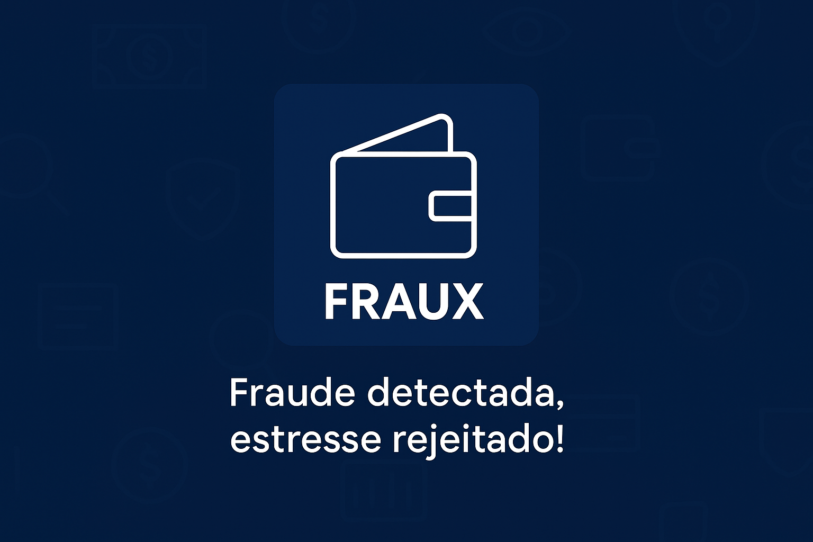

<p align="center">
  
</p>

<h1 align="center">FRAUX – JAR Executável (Processamento de Fraudes)</h1>

<p align="center">
  Repositório responsável pela aplicação JAR que processa dados de transações e alimenta a plataforma Fraux 💳🛡️
</p>

---

## 📚 Visão Geral

O **Fraux – Jar Executável** é o componente de backend responsável por:

- Ler arquivos de dados de transações (planilhas Excel);
- Tratar, transformar e padronizar esses dados;
- Persistir as informações em um banco de dados relacional;
- Disponibilizar a aplicação em formato **JAR executável**, facilitando a execução em diferentes ambientes (local ou servidor).

Ele é parte da solução proposta por nós da **Fraux**, cujo objetivo é gerar indicadores e insights sobre chargebacks e tentativas de fraude.

---

## 🧩 Papel no Projeto Fraux

Dentro da plataforma Fraux, este módulo funciona como o **motor de processamento de dados**:

1. Recebe um **arquivo XLSX** contendo dados de transações de e-commerce;
2. Lê e interpreta o conteúdo da planilha usando **Apache POI**;
3. Aplica regras de negócio e transforma os dados brutos em informações estruturadas;
4. Grava as informações no banco **MySQL** por meio de **JDBC**;
5. A camada de **dashboard / aplicação web** consome essas informações para exibir métricas e gráficos para o usuário final.

Enquanto o repositório do **site institucional** trata da parte visual (páginas e dashboards), aqui fica a **lógica de processamento em Java**, empacotada em um JAR executável.

---

## 🏗 Arquitetura de Execução (resumo)

- Arquivo **XLSX** com dados de transações é utilizado como entrada;
- O **JAR Java**:
    - lê o arquivo com **Apache POI**;
    - processa e converte os dados;
    - grava as informações no **MySQL** via **JDBC**;
- A aplicação web/dashboards consome os dados do banco para exibir os indicadores de fraude.

---

## 🛠 Tecnologias Utilizadas

Apenas as tecnologias utilizadas neste repositório:

- **Java 21** – linguagem principal da aplicação;
- **Maven** – gerenciamento de dependências e build do projeto;
- **JDBC** – acesso e operações em banco de dados relacional (MySQL);
- **Apache POI** – leitura e manipulação de arquivos Excel (XLSX).

---

## ✅ Pré-requisitos

Para compilar e executar o JAR, você precisa de:

Java JDK 21 instalado;

Maven instalado e configurado;

Um banco de dados MySQL acessível (com usuário e senha configurados);

Configuração da conexão JDBC na aplicação (URL, porta, banco, usuário e senha).

---

## ⚙️ Como Gerar o JAR

1. Clonar o repositório

```git clone "https://github.com/Grupo-10-E-commerce/java-jar-executable.git"```

2. Ir até a pasta do repositório

```cd java-jar-executable```

3. Compilar o projeto e gerar o jar executável


```mvn clean package```

4. Ao final, o Maven irá gerar o arquivo JAR na pasta target/

--- 

## 🚀 Como Executar o JAR

Exemplo de execução do JAR:

```java -jar target/java-jar-executavel-1.0-SNAPSHOT.jar```

Após isso o jar será executado e cumprirá sua função.

---
